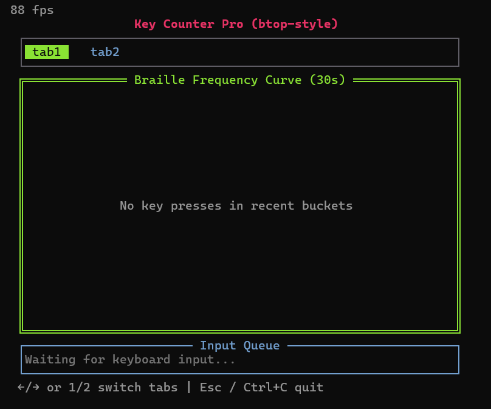
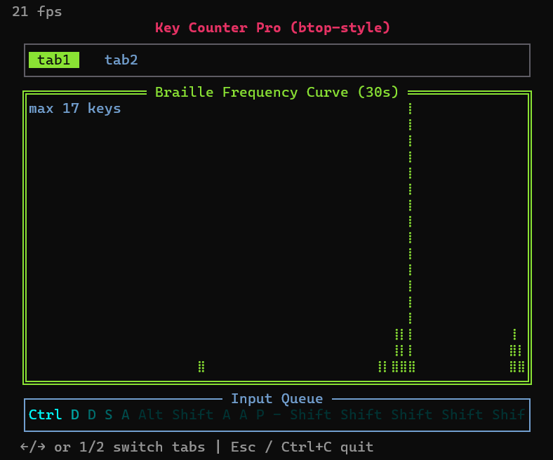

[中文](README.md) | [English](README.en.md)

# Keyboard Monitor (btop-style)

## Overview
A Go-based keyboard monitor with a btop-like look and feel, built for learning.

## Features
- Real-time keyboard input monitoring
- Native Windows API support
- Clear, terminal-based UI

## Technical Notes
- Built using vibe coding as the development approach
- UI built with [tview](https://github.com/rivo/tview)
- Terminal rendering powered by [tcell](https://github.com/gdamore/tcell)

## Screenshots




## Usage

### Requirements
- Go 1.20 or later
- Windows OS

## Project Structure
```
键盘监测_btop风格/
├── go.mod                # Go module file
├── main.go               # Entry point
├── internal/
│   ├── display/
│   │   └── UI.go         # UI code
│   ├── keyboard/
│       ├── RawInput_study.go  # Keyboard input handling
│       ├── RawInput.txt       # Sample input data
│       └── WindowsAPI.go      # Windows API wrapper
```

## Contributing
Issues and pull requests are welcome.

## License
This project is licensed under the [MIT License](LICENSE).

## Author
- **fyuo863** - [GitHub Profile](https://github.com/fyuo863)

---
